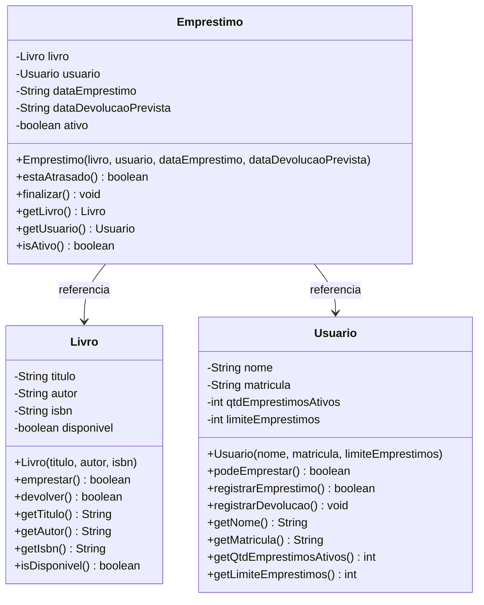

# Modelagem — Domínio Biblioteca (Grupo 1)

## Diagrama de classes (Mermaid)



## Diagrama de classes (texto estruturado estilo UML)

```
+-----------------------------+
|            Livro            |
+-----------------------------+
| - titulo : String           |
| - autor : String            |
| - isbn : String             |
| - disponivel : boolean      |
+-----------------------------+
| + emprestar() : boolean     |
| + devolver() : boolean      |
+-----------------------------+

+-----------------------------+
|          Usuario            |
+-----------------------------+
| - nome : String             |
| - matricula : String        |
| - qtdEmprestimosAtivos : int|
| - limiteEmprestimos : int   |
+-----------------------------+
| + podeEmprestar() : boolean |
| + registrarEmprestimo() : boolean |
| + registrarDevolucao() : void     |
+-----------------------------+

+-----------------------------+
|         Emprestimo          |
+-----------------------------+
| - livro : Livro             |
| - usuario : Usuario         |
| - dataEmprestimo : String   |
| - dataDevolucaoPrevista : String |
| - ativo : boolean           |
+-----------------------------+
| + estaAtrasado() : boolean  |
| + finalizar() : void        |
+-----------------------------+
```

## Justificativa das classes

| Classe | Por que existe |
|---|---|
| `Livro` | Identidade própria (título/autor/ISBN) e comportamento de ser emprestado ou devolvido. |
| `Usuario` | Identidade própria (nome/matrícula) e comportamento de controlar seus empréstimos dentro de um limite. |
| `Emprestimo` | Liga um livro a um usuário em um momento específico, com data prevista de devolução e status ativo/devolvido/atrasado. |

## Relacionamentos

- `Emprestimo` **referencia** um `Livro` e um `Usuario` (não é herança: cada classe tem responsabilidades distintas).
- `Livro` e `Usuario` não dependem de `Emprestimo`: o empréstimo coordena o estado dos dois ao ser criado e finalizado.
