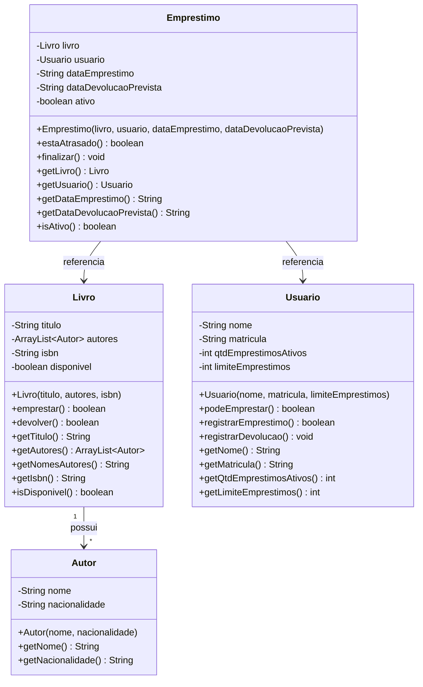

# Modelagem — Domínio Biblioteca (Grupo 1) — Etapa 2

## Diagrama de classes (Mermaid)



## Diagrama de classes (texto estruturado estilo UML)

```
+-----------------------------+
|           Autor             |
+-----------------------------+
| - nome : String             |
| - nacionalidade : String    |
+-----------------------------+
| + Autor(nome, nacionalidade)|
| + getNome() : String        |
| + getNacionalidade() : String|
+-----------------------------+

+---------------------------------+
|             Livro               |
+---------------------------------+
| - titulo : String               |
| - autores : ArrayList~Autor~    |
| - isbn : String                 |
| - disponivel : boolean          |
+---------------------------------+
| + Livro(titulo, autores, isbn)  |
| + emprestar() : boolean         |
| + devolver() : boolean          |
| + getAutores() : ArrayList~Autor~|
| + getNomesAutores() : String    |
+---------------------------------+

+-----------------------------+
|          Usuario            |
+-----------------------------+
| - nome : String             |
| - matricula : String        |
| - qtdEmprestimosAtivos : int|
| - limiteEmprestimos : int   |
+-----------------------------+
| + podeEmprestar() : boolean |
| + registrarEmprestimo() : boolean |
| + registrarDevolucao() : void     |
+-----------------------------+

+--------------------------------+
|         Emprestimo             |
+--------------------------------+
| - livro : Livro                |
| - usuario : Usuario            |
| - dataEmprestimo : String      |
| - dataDevolucaoPrevista : String|
| - ativo : boolean              |
+--------------------------------+
| + estaAtrasado() : boolean     |
| + finalizar() : void           |
+--------------------------------+
```

## Justificativa das classes

| Classe | Por que existe |
|---|---|
| `Autor` | Representa o autor de um livro. Um livro pode ter mais de um autor, e um autor pode escrever vários livros. Separar autor em classe própria permite representar essa relação. |
| `Livro` | Identidade própria (título/autores/ISBN) e comportamento de ser emprestado ou devolvido. Agora usa `ArrayList<Autor>` para suportar vários autores. |
| `Usuario` | Identidade própria (nome/matrícula) e comportamento de controlar seus empréstimos dentro de um limite. |
| `Emprestimo` | Liga um livro a um usuário em um momento específico, com data prevista de devolução e status ativo/devolvido/atrasado. |

## Mudanças da Etapa 2 em relação à Etapa 1

| O que mudou | Por que mudou |
|---|---|
| Criada a classe `Autor` | O professor solicitou suporte a vários autores por livro |
| `Livro.autor` (String) virou `Livro.autores` (ArrayList\<Autor\>) | Um livro pode ter mais de um autor |
| Adicionado `getNomesAutores()` no Livro | Método utilitário para exibir os nomes dos autores no console |
| Atributos permanecem privados (já eram na Etapa 1) | Encapsulamento — ninguém de fora deve alterar estado diretamente |
| Adicionadas validações no Main | Demonstrar que métodos de negócio protegem o estado melhor que setters |

## Relacionamentos

- `Livro` **possui** um ou mais `Autor` (relacionamento 1 para muchos).
- `Emprestimo` **referencia** um `Livro` e um `Usuario`.
- `Autor` e `Usuario` não dependem de `Emprestimo`.
- `Livro` e `Usuario` não dependem de `Emprestimo`.
